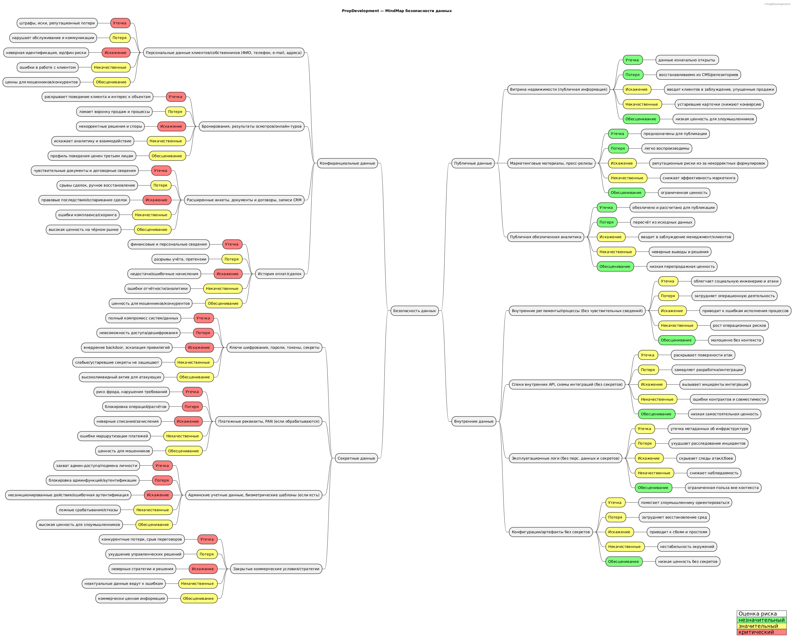

# Проверочный лист по безопасности данных

Классификация выполнена в соответствии с ISO/IEC [27001](https://www.iso.org/standard/27001) и [27002](https://www.iso.org/standard/27002).

## Классификация данных
- **Публичные данные**: информация витрины о недвижимости (без перс. данных и закрытых полей), публичные маркетинговые материалы, открытые пресс-релизы, обезличенная публичная аналитика.
- **Внутренние данные**: внутренние регламенты/процессы без чувствительных сведений, спецификации внутренних API и схемы интеграций без секретов, эксплуатационные логи без перс. данных, конфигурации и артефакты сборки/деплоя без секретов.
- **Конфиденциальные данные**: персональные данные клиентов/собственников (ФИО, телефон, e‑mail, адрес, идентификаторы), данные бронирований и результатов осмотров/онлайн-туров, расширенные анкеты и документы по онлайн‑сделке, записи CRM, история оплат и договоров.
- **Секретные данные**: ключи шифрования, пароли, токены и другие секреты, платежные реквизиты и PAN (если обрабатываются), администраторские учетные данные, биометрические шаблоны (если обрабатываются), закрытые коммерческие условия и стратегии.

## Риски и обоснования

### Публичные данные
- Утечка — незначительный: данные изначально открыты.
- Потеря — незначительный: восстанавливаемо из источников/репозиториев.
- Искажение — значительный: вводит клиентов в заблуждение, репутационные потери, прямые упущенные продажи.
- Некачественные — значительный: устаревшие карточки объектов ухудшают конверсию.
- Обесценивание — незначительный: низкая стоимость для злоумышленника.

### Внутренние данные
- Утечка — значительный: раскрывает внутренние процессы/топологию, облегчает атаки.
- Потеря — значительный: замедляет разработки и эксплуатацию.
- Искажение — значительный: приводит к сбоям интеграций и инцидентам.
- Некачественные — значительный: рост операционных рисков, инциденты в проде.
- Обесценивание — незначительный: полезность ограничена без контекста.

### Конфиденциальные данные
- Утечка — критический: персональные данные, договорная информация ведёт к регуляторным искам, штрафам, оттоку клиентов.
- Потеря — значительный: нарушает операции (сделки, расчеты), повышает риск инцидентов.
- Искажение — критический: неверные данные клиентов/сделок, следовательно юридические/финансовые последствия.
- Некачественные — значительный: ошибки в скоринге, сделках, поддержке клиентов.
- Обесценивание — значительный: массовая агрегированная выгрузка ценна на черном рынке/для конкурентов.

### Секретные данные
- Утечка — критический: компрометация секретов/ключей ведет к широким взломам.
- Потеря — критический: невозможность дешифрования/восстановления, длительные простои.
- Искажение — критический: backdoor и эскалация привилегий.
- Некачественные — значительный: ошибки ротации/хранения создают ложное чувство безопасности.
- Обесценивание — значительный: комплекты секретов имеют высокую рыночную стоимость.

## Оценка рисков (шкала: незначительный / значительный / критический)

| Категория           | Утечка        | Потеря         | Искажение      | Некачественные | Обесценивание  |
|---------------------|---------------|----------------|----------------|----------------|----------------|
| Публичные           | незначительный| незначительный | значительный   | значительный   | незначительный |
| Внутренние          | значительный  | значительный   | значительный   | значительный   | незначительный |
| Конфиденциальные    | критический   | значительный   | критический    | значительный   | значительный   |
| Секретные           | критический   | критический    | критический    | значительный   | значительный   |

## Визуализация (mindmap)

Исходник: [data-security-mindmap.puml](data-security-mindmap.puml)

