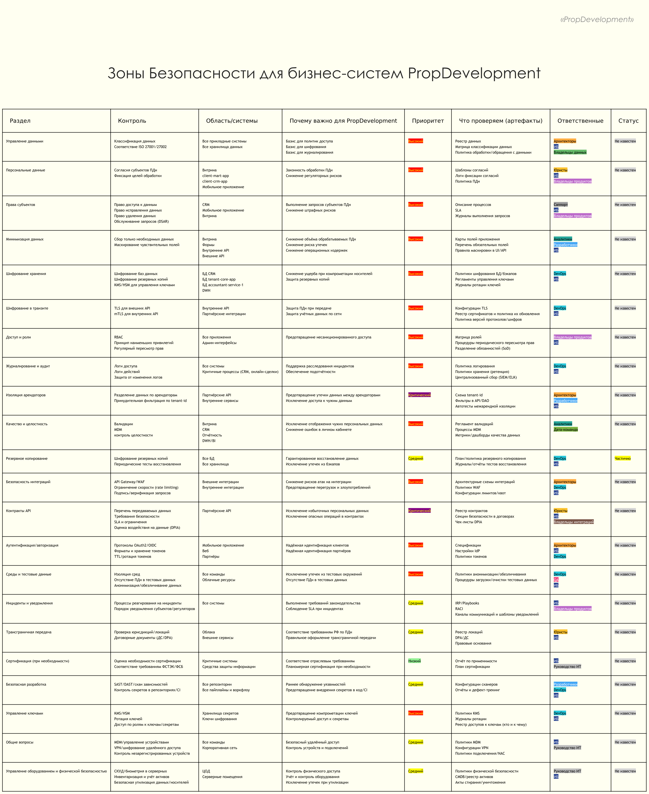
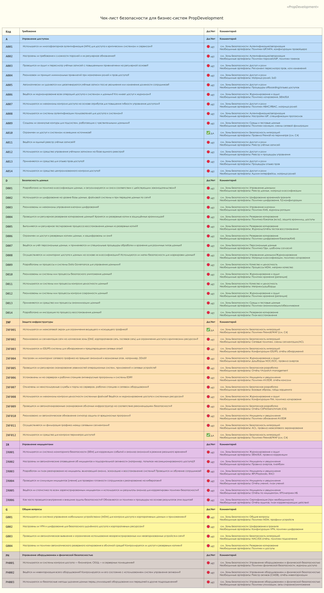

# Проверочный лист безопасности для бизнес‑систем

## Анализ схемы и описание системы

Идентификация систем и характер работы с данными:
- **Витрина продаж (монолит)**: сбор контактных данных, формы с расширенными полями (ПДн).
- **client-tour-app (онлайн‑тур)**: данные осмотров/туров, привязка к бронированиям.
- **client-mart-app (онлайн‑сделка)**: юридически значимые операции, интеграции с госорганами.
- **client-crm-app (CRM) и БД**: мастер‑данные клиентов/собственников, права субъектов ПДн.
- **client-mart-estate-app**: данные объектов недвижимости.
- **Мобильное приложение для собственников**: платежи ЖКУ, управление «Умным домом».
- **tenant-core-app и БД**: услуги для собственников, операции по ЖКУ.
- **accountant-service-1 и БД**: финансовые данные, учёт.
- **DWH/BI/отчётность**: агрегирование, аналитика, качество данных.
- **Партнёрские API**: сторонние УК; повышенные требования к контрактам, изоляции и шифрованию.

## Выбор разделов и приоритет

- **Контроль данных**:
  - **Классификация данных (high)**: базис для доступа, шифрования и журналирования.
  - **Минимизация данных (high)**: снижает объём ПДн и риск утечек.
  - **Доступ и роли / RBAC, SoD (high)**: предотвращает несанкционированный доступ.
  - **Журналирование и аудит (high)**: расследование инцидентов, подотчётность.
  - **Качество и целостность, MDM (high)**: устраняет ошибки в личном кабинете и смешение чужих ПДн.
  - **Резервное копирование (medium)**: восстановление и защита бэкапов.
  - **Среды и тестовые данные (high)**: исключает утечки из тестовых окружений.

- **Проблемы с API партнёров**:
  - **Безопасность интеграций (high)**: API Gateway/WAF, rate limiting, подпись/верификация.
  - **Контракты API и DPIA (critical)**: контроль передаваемых данных и опасных операций.
  - **Шифрование в транзите (high)**: TLS/mTLS — защита ПДн и учётных данных.
  - **Изоляция арендаторов/tenant-id (critical)**: исключение межарендных утечек.
  - **Аутентификация/авторизация (high)**: OAuth2/OIDC, политики токенов.

- **Техническая защита данных**:
  - **Шифрование хранения (БД/бэкапы) (high)**: снижение ущерба при компрометации носителей и резервных копий.
  - **Управление ключами (KMS/HSM, ротация) (high)**: предотвращение компрометации ключей, управляемый доступ к секретам.
  - **Безопасная разработка (SAST/DAST/скан зависимостей/секретов) (medium)**: раннее выявление уязвимостей и исключение секретов в коде/CI.

- **Законодательство и соответствие ПДн**:
  - **Персональные данные — согласия и цели обработки (high)**: законность обработки и доказуемость согласий.
  - **Права субъектов (DSAR) (high)**: способность выполнять запросы субъектов и снижать регуляторные риски.
  - **Трансграничная передача ПДн (medium)**: соблюдение требований к локациям/юрисдикциям и правовым основаниям.
  - **Сертификация (ФСТЭК/ФСБ при необходимости) (low/контекстно)**: выполнение отраслевых требований для критичных систем.

- **Инциденты и уведомления (medium)**: регламент реагирования (IRP/плейбуки), RACI и каналы уведомления обеспечивают выполнение требований законодательства и SLA при инцидентах; без них возрастает риск задержек и штрафов.

## Зоны безопасности

Прежде чем определять, в каком состоянии безопасность в компании составим список областей и зон ответственности. Таким образом чек-лист можно будет составить совместно с релевантными подразделениями и экспертами.

[security-areas.puml](security-areas.puml)

### Примечание по статусам:
- **Не известен**: нет артефактов/доказательств выполнения; нужен перечень из колонки «Что проверяем (артефакты)».
- **Частично**: часть артефактов есть (например, бэкапы настроены), нет регулярных тестов/политик/логов.
- **Готово**: артефакты предоставлены и проверены, процессы внедрены и поддерживаются.

### Состав артефактов

- `security-areas.puml`: исходных код таблицы.
- `security-areas-responsibles.iuml`: словарь ролей и цветов.
- `security-areas-priorities.iuml`: словарь приоритетов и цветов.
- `security-areas-statuses.iuml`: словарь статусов и цветов.

## Чек-лист безопасности

Получился достаточно грустным. За необходимой информацией по пунктам "НЕТ" следует обратиться к таблице **Зоны безопасности** (выше) и, консультируясь с профильными руководителями и экспертами, проводить работы по их заполнению. 

[security-checklist.puml](security-checklist.puml)

